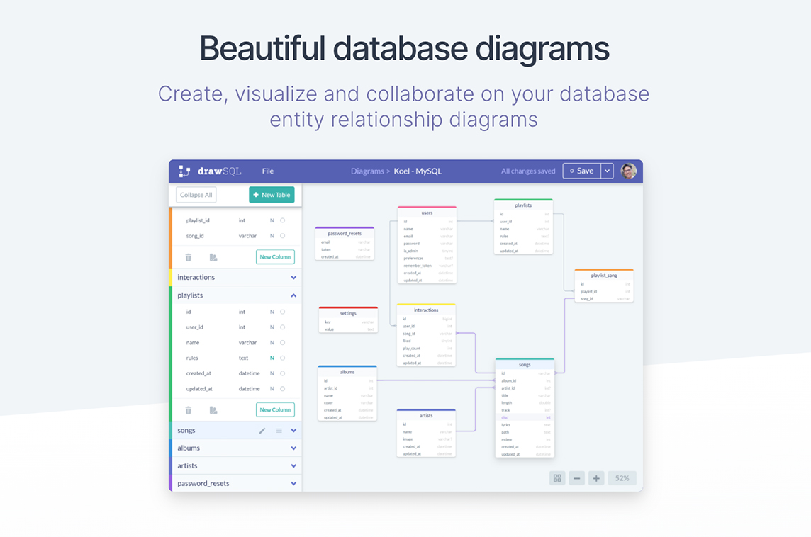
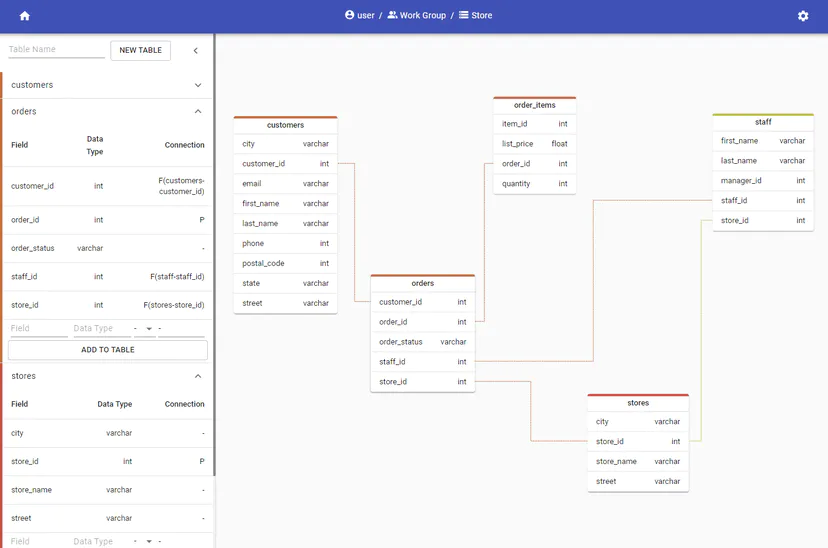
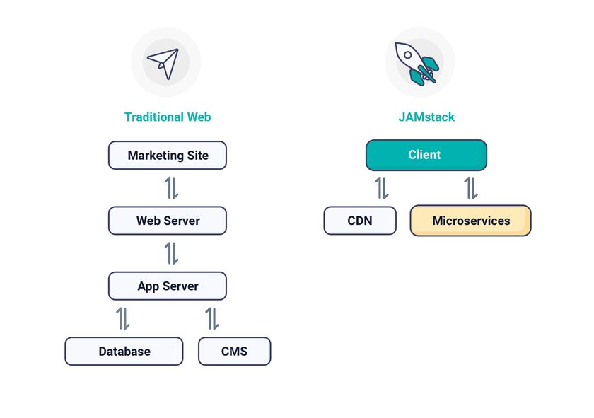
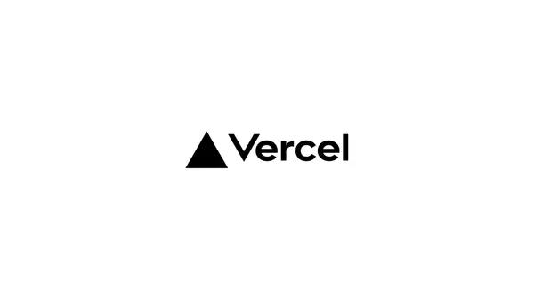

What better way to hone your web development skills than to make random apps?

I was doing a [MySQL course on Udemy](https://www.udemy.com/course/the-ultimate-mysql-bootcamp-go-from-sql-beginner-to-expert/?ranMID=39197&ranEAID=A3wU3Z96xXM&ranSiteID=A3wU3Z96xXM-72P09tkOlaPPno_CYLA75g&LSNPUBID=A3wU3Z96xXM&utm_source=aff-campaign&utm_medium=udemyads) and was using the CLI for CRUD operations andto view my tables in the database. I remember thinking that there could be a better way to visualise the tables and my data, and wanted to try my hand at building something from scratch.

I stumbled across [DrawSQL](https://drawsql.app/), an app that allowed you to build good looking organized diagrams based on your databases' schemas, and thought that it looked pretty neat. With only the image on their landing page as a reference, I started laying out the groundwork for my own Database Visualisation App. I didn't even sign up for DrawSQL to try to get a feel of how the app should be working, which was a mistake on my part.

_Image used as reference_

Looking back at it now, I did it the opposite of how I should have done it. Getting a feel of the app and how it worked should have been my priority, not referencing the image and getting the main feature of my app to look similar to their app. Now my app looks like a rip-off of theirs, instead of having similar features but a different overall feel.

## About the app

It took me about a week to finish building my [database visualiser app](https://dbvis.vercel.app/), not including the time taken for me to find and fix bugs. There are still a lot of unfinished features and bugfixes to be implemented, and I suspect it will take quite long until the app is fully functional.

Suspiciously similar to DrawSQL... As of now, it has most of the features I would like it to have, including the main functionality, the connections between tables, as well as drag and drop.The GitHub Repository is [here](https://github.com/nghochi123/dbvis) if you would like to learn more about the app, and how much progress I've made with it.## Next.js as a frameworkI've used Create React App as well as GatsbyJS to make React apps before, so [Next.js](https://nextjs.org/) looked like a good framework to try out next.

Next.js is more for creating sites with more emphasis on Server Side Rendering, while Gatsby is for static site generation and CRA uses client side rendering. Since my app needs to deal with user data, Gatsby was out of the question. With CRA, I would have to make an API to grab information from the server side, and loading times would be longer. Looking at my options, Next.js was the obvious choice here.

One of my favourite things about Next.js is that you can have APIs right inside your app. That is, links to '/api/...' serve as APIs where I can communicate with my database, without creating an intermediate server. Usually, what I would be doing (and I think what most people do) is to create an intermediate server with Express or some other back end web application framework. The simplified version is that the front end makes requests to the database through the server which would then return the needed information through the server again. Notice how the server is just a middleman for everything.

This should be a decent representation of what I'm trying to present, but I'm still quite a beginner at this so don't take my word for it. Gatsby also provides such built in features, using GraphQL instead of REST, where I was able to get the markdown data for my blog posts.

## Working with a relatively big application

While most people will not consider this app 'big', I've not have had experience working on something for more than 3 days and this was quite new to me. Being used to relatively smaller apps, I've been able to get away with leaving my code messy. When I was starting out working on this app, things were progressing quite quickly. I got the main layout of the diagram builder, as well as the drag and drop components working within a day or two.

However, things got progressively harder from there as I kept encountering more and more bugs, and I was getting increasingly frustrated at my own code. I had to spend some time refactoring my code which could have been used working on the project. Despite having come up with a plan for how the layout and data should be stored, I did not consider coming up with a plan for how my code should be organised (my code mainly splits things into components, containers and resources). The code in my current version of the app is still quite nasty, and I might look into refactoring it soon.The unorganized code, in my opinion, acts like an invisible barrier that will make one feel very reluctant to further work on the project, be it refactoring of code or fixing of bugs. When working with others on projects, I believe that this will also be the source of a lot of time wastage in having people trying to understand each other's illegible code. If I were to take away only one thing from this project, I guess it would be to spend a lot more effort planning my code structure and splitting my code into smaller bits.

## Authentication

Authentication is another one of those things that I feel that I did not do well. I used JsonWebTokens and BCrypt to generate tokens and hash passwords respectively, which were good decisions for this project. However, I stored my tokens and user data in quite an unorthodox way. Usually, people will either store their tokens in the browser in two ways. Either in the browser's local storage (less secure), or by passing the token in the request headers as a Bearer token in a HttpOnly cookie(more secure). Instead, I decided to store my token in Context.

At first glance, context looks like a viable option, providing a way to store and retrieve our token without exposing it to the browser (I think). However, something I overlooked was that the token stored in Context will disappear everytime the user refreshes the page or navigates to another link by typing in the browser. This will cause the user to log out of the app pretty often, before the token is expired, which is quite undesired. Looking at it now, passing the token as a Bearer token in request and response headers would be what I would choose for most of my projects following this. It is the most popular way of storing and verifying JWTs, and for good reason.

## User Experience

Although I bashed my project quite a bit above, I feel that there are some parts of my project that are redeemable and I would consider carrying over the ideas to future projects. Thinking about most of the sites I visit, I realise that I abandon sites quite quickly. I would usually want to get an experience of an app's functionalities before even signing up, and therefore, I thought of creating a guest page. The guest page has the same functionalities as the main page of a normal account, just without the ability to collaborate and save your data. However, it gives users a quick sneak peak at what you could do with an account.I also created a help page (similar to documentation for other bigger projects). I think this is also something that will enable users to use my app with less trouble. Some feedback I got with regards to was that the help page is catered to users who have experience with relational databases - for example, references to primary and foreign keys were made, which people without knowledge of SQL may not understand.

## Back-end

Since the app's purpose was to visualise a SQL-like database, I decided to build the backend with MySQL, and it has 7 tables in total. Aside from storing user, group, database and table information in their own table, I have also created two additional tables to store connections for many to many connections, and one to store field connections. This way of storing information has proven to be all I need for the operations of my application. Overall, I'm quite satisfied with the state of my back-end despite it being simple to use. Personally, however, I have a preference for NoSQL databases like MongoDB. CRUD with MongoDB makes more sense as the JSON format of storing data makes more sense to use with JavaScript.

## Appreciation for Version Control

It's very frustrating when you work on some aspect of your project for quite a while, only for it to not work in the end. What's more frustrating is trying to manually roll back your changes through a few files, and CTRL-Z won't work because you saved your changes and closed your editor. I'm very grateful for Git for saving me the trouble of going through the second part of suffering - as before I made any changes, I would work on it in a separate branch first, test the changes and merge the branches only if the changes do not mess up my app's functions. If there were problems, I could always go back to the branch I came from without having to manually check for any problems. With this, I could worry less about accidentally closing my code editor or restarting my PC to perform an update.

## Deployment platform

99 programming bugs in the code.

99 programming bugs.

Take one down, patch it all up.

111 programming bugs in the code.

This is a joke on reddit I could relate to when I started my programming journey a while ago, and I just remembered it again when I was spending a whole day fixing bugs in my code, to try to deploy my app online. GitHub pages was a no-go as it only renders static sites, and I was quite comfortable with Netlify, so I initially intended to publish the app on Netlify. However, Netlify's deploy was giving me a lot of trouble despite being able to build locally. Problems ranged from packages not found, and problems with image processing. The missing packages were possibly due to npm install being run before build time, with some node modules' inner dependencies not actually being used (such as Knex's Postgres module not being used because I'm using MySQL).

An approach I could take is to repeatedly deploy, fix the problems one by one, but this would take extremely long. I was quite tempted to do so after hours of scouring Google and Stack Overflow for answers. However, one answer online (as well as error logs in some of my build processes) suggested deploying to Vercel instead. I've only known Vercel as the developers of Next.js, but not as a deployment platform. After a lot of stubborn trying, and reading more about Vercel, I decided to try deploying on Vercel instead.

Enter Vercel. Turns out, Vercel was as easy to deploy onto as Netlify, and since they're the creators of Next.js, they have easier integration with Next.js apps. I really appreciated that I had to do next to nothing to get my app deployed there, and was happy with the result. Not saying that Netlify is bad - I'm glad that I have more options to choose where I want to deploy my app to. Furthermore, I'm not good enough of a developer (yet hopefully) to fully appreciate the functions and benefits that both Vercel and Netlify has to offer.

## Conclusion

Despite how much I've been complaining about how frustrating the build process is, I would say confidently that I enjoyed the build process and am quite satisfied with how the app turned out so far. Although there are many places where I could obviously improve my app, I guess I'll be moving on from this app to bigger, more adventurous projects. I'll still pop back to update the features and fix some bugs as promised, but that'll be less of a priority for me.
