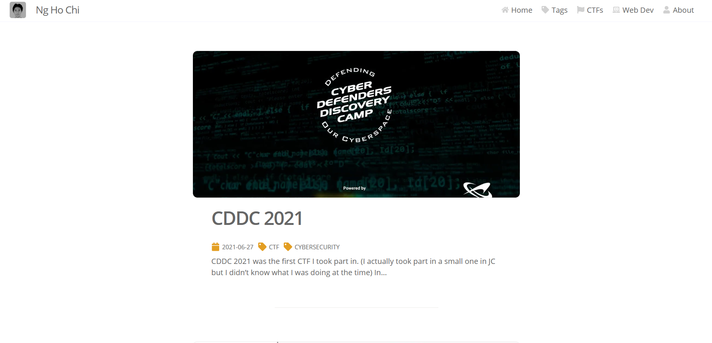
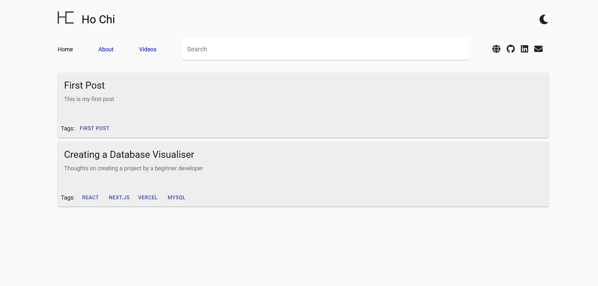

Making your own stuff is cool and all, but sometimes it's just better to stick to stuff other people have already made, unless you're trying to learn something on your own, or are willing to put in a lot of effort to build the project.

To be fair, my initial intention behind my old blog was to create a blog where I could log my thoughts and preferences while learning and refining my Front and Back end integration skills. However, after I finished the project, I didn't really feel satisfied with the end product, and it affected my willingness to continue writing. Especially since I took only around 2 to 3 days to make the blog and integrate the backend, it was quite evident that I wasn't willing to put that much effort into building the blog for myself.

During the conceptualization stage, I thought markdown was a good idea, and I still do, my current blog uses markdown, as it's simple enough to write and easy to integrate. I also wanted to have authentication and post uploading through the web app, which, unlike markdown was quite a bad idea.

## Authentication and post uploading

Building authentication into the blog to control your posts is not really a bad idea per se - but there are more efficient ways of managing your posts. For example, I feel that my current way of managing posts by uploading static .md files on GitHub is much better and much easier to manage.
