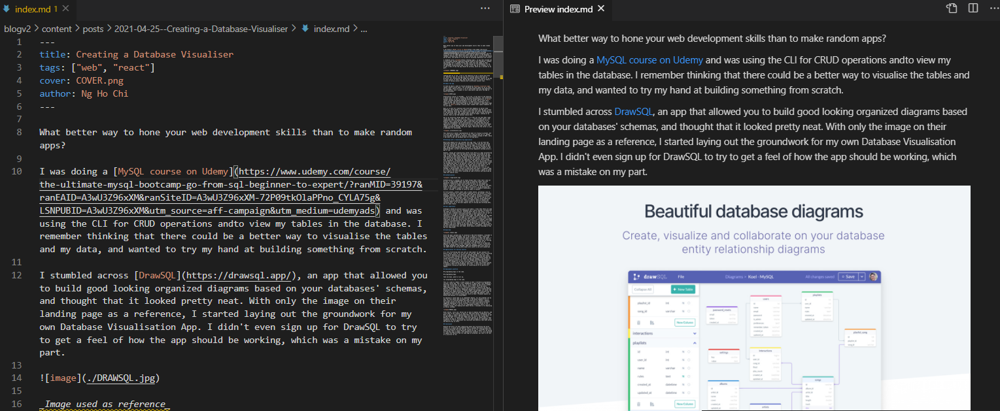
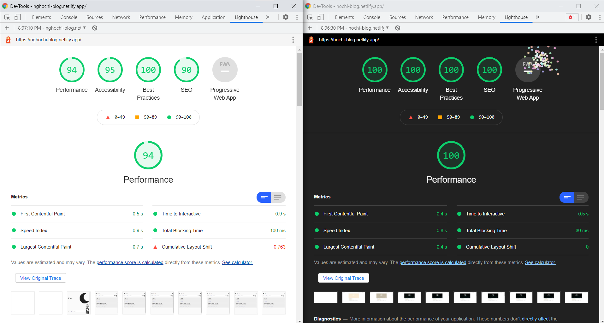
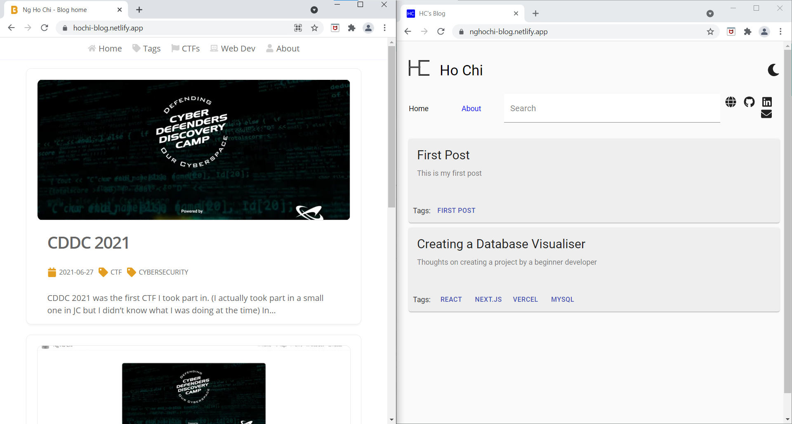
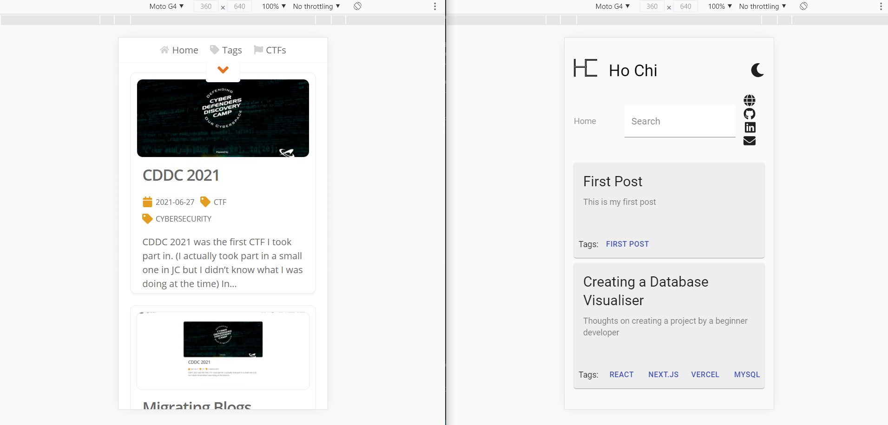

Making your own stuff is cool and all, but sometimes it's just better to stick to stuff other people have already made, unless you're trying to learn something on your own, or are willing to put in a lot of effort to build the project.

To be fair, my initial intention behind my old blog was to create a blog where I could log my thoughts and preferences while learning and refining my Front and Back end integration skills. However, after I finished the project, I didn't really feel satisfied with the end product, and it affected my willingness to continue writing. Especially since I took only around 2 to 3 days to make the blog and integrate the backend, it was quite evident that I wasn't willing to put that much effort into building the blog for myself.

During the conceptualization stage, I thought markdown was a good idea, (and I still do, my current blog uses markdown), as it's simple enough to write and easy to integrate. I also wanted to have authentication and post uploading through the web app which, unlike markdown, was quite a bad idea.

## Authentication and post uploading

Building authentication into the blog to control your posts is not really a bad idea per se - but there are more efficient ways of managing your posts, especially if you're the only one writing posts anyway.

### Convenience

With my old blog, I managed posts by logging into the blog and making a post in markdown there, which would then be sent to MongoDB Atlas. I would have to blindly write markdown and hope that I didn't miss a space after a hash when writing headers or that I didn't paste a url incorrectly (or I can write markdown somewhere else and paste it into the text box but that's extra work).

Now, since my posts are in markdown, I can just write markdown in Visual Studio Code and push changes to GitHub. This has the added convenience of being able to visualise the markdown written with VSCode's markdown preview. Editing or deleting posts are much easier as well, as I didn't actually implement that feature in my old blog. That's right - I was not willing to put in enough effort, and it shows in how difficult it is to do basic stuff.

The way images were handled was also one of my main gripes I had with the old blog. Uploading my posts to MongoDB meant that I would have to either upload my images as a binary (which might take up a lot of space) or link directly to the images. On the other hand, with the new blog, I am able to store my images locally, meaning it's much easier to reference and change. The new blog also helps with sizing my images such that it doesn't overflow the page horizontally, making life much easier.

### Security

Another problem with my old method of authentication is that my API is left public. (That's on me, usual APIs won't be public) This means that anyone with the link can simply create a user and create a post if they figure out the API to use. (That's on me as well, I should have never made an API to allow users to be created.)

With the new blog, since I'm the only person that can post to my own GitHub, (I'm sure GitHub's security is much better than whatever I can make, at least) posts can't be created, read, updated or deleted by others.

### Performance

Having posts and images stored locally compared to having to query a database through an API for data makes a huge difference in terms of performance. Having to query the database every time a post is selected or when the main page is refreshed is bound to cost quite a bit of performance.

I'm honestly not sure what this means but it kind of shows that the new blog (on the right) is more performant than the old one, especially since the new blog has much more features and animations.

## Aesthetics

Comparing both my blogs side to side, there is no doubt that the new blog (on the left) is better looking than the one on the right.

Research has proven that foods taste better when they are self-made, but even I felt that mine could not even compare to what others have made. Don't get me wrong, I'm very satisfied with what I made in the past, building whatever I did from scratch with just around two days of time and being a relatively inexperienced developer. However, it simply cannot compare to what more experienced developers can make. (Hint: I think it's because they have done web development for much longer, and do it as a job)

While I had made my blog with media queries in mind, it still looks quite bad compared to what the new blog can offer.

With better aesthetics, people will have an easier time reading posts (and would be more willing to).

## Conclusion

While I did bash my self-made blog quite a bit, I still think it was a good thing I built it, even if it was just for the experience and self-gratification. I would recommend that anyone try to build a blog for themselves, as long as they have enough time (maybe a week or two) and commitment to design and build one. Maybe it will even look better than what you can get online, and you will be able to customise and fix bugs more easily.
