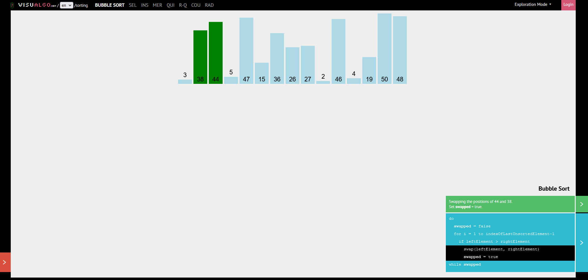
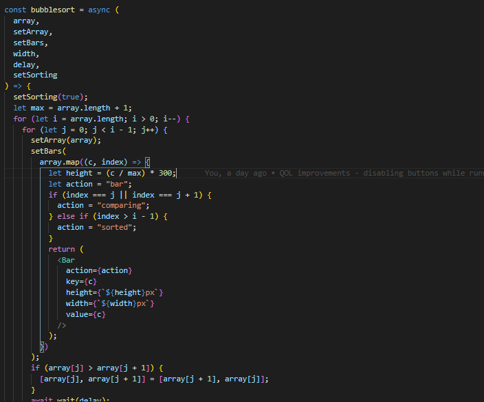
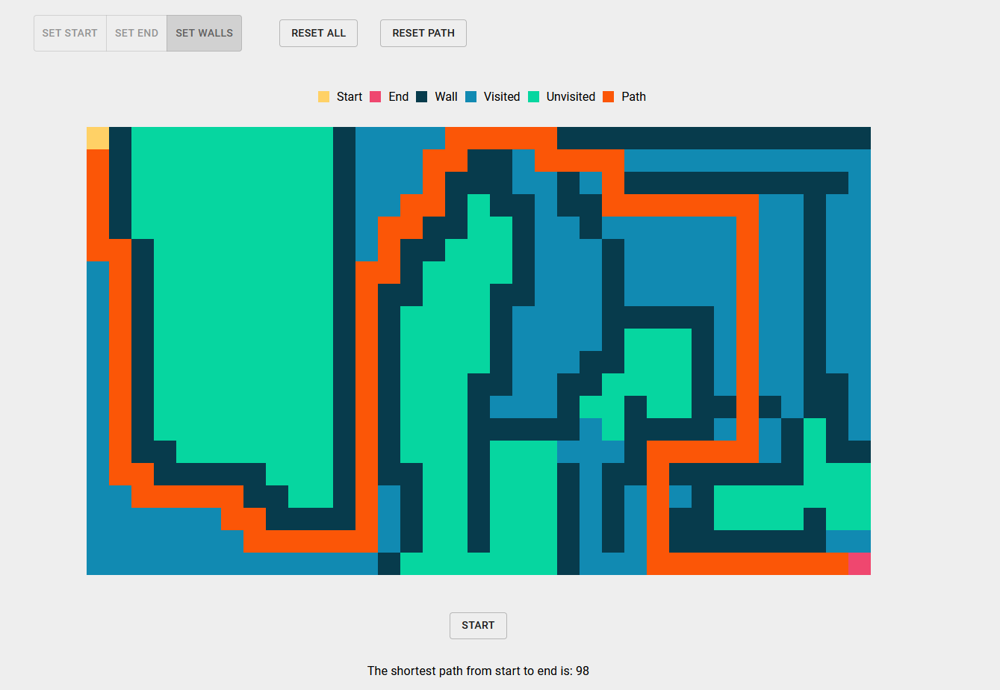
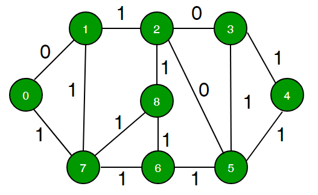
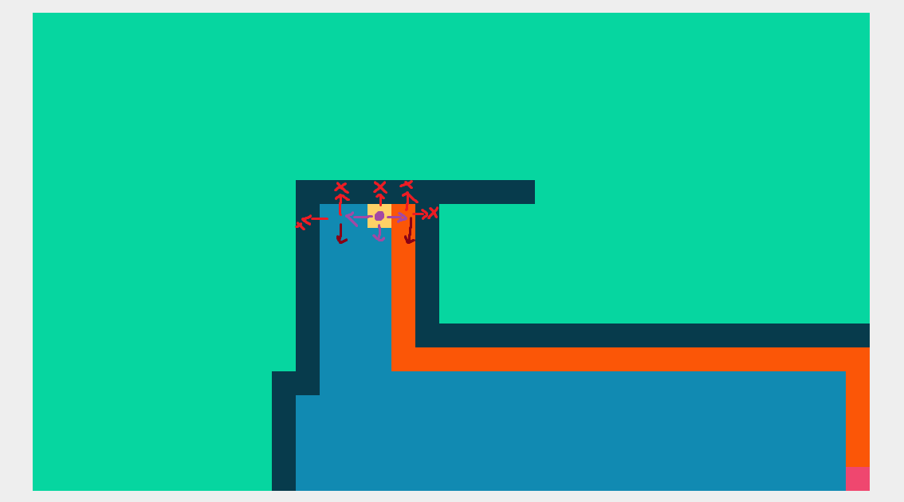
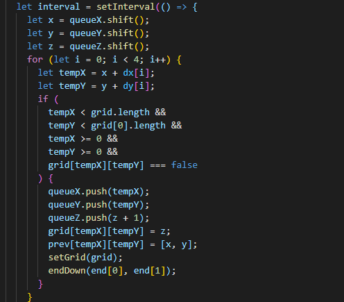
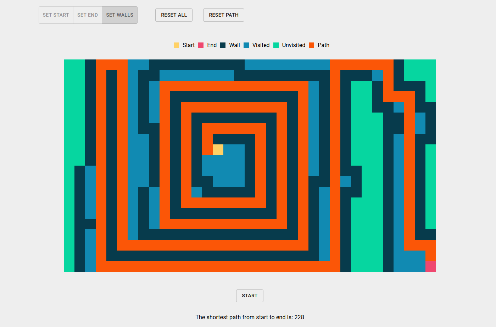

<re-img src="VIS.png" title="CDDC"></re-img>

Recently, I've been looking back at some older projects and some notes I had written for myself after I "finished" them. More accurately speaking, I decided to temporarily abandon them until I got good enough to figure out how to implement my ideas. One of these abandoned projects is my [Algorithm Visualiser](https://hcvisualisation.netlify.app/).

Initially inspired by [VisuAlgo](https://visualgo.net/en) which I used alot to help make sense of algorithms at the start of my coding journey, I tried to make a visualisation app similar to that.

I implemented four sorting algorithms: bubble sort, selection sort, insertion sort and quicksort. The four algorithms weren't complicated on their own, but trying to incorporate visualisation into the equation makes it a whole lot tougher.

I thought it would just be a matter of passing the array from the algorithm function to the render method, but it doesn't work like that. Setting the array state from the inner function did not do the trick either.

In the end, the method I found worked (probably not the best solution) was to set an array of bar components into the state, to force the re-rendering of the components, whenever a swap is being made.

I did this for all four of the sorting algorithms, and it worked! Except for quicksort. For the first few times the user tried to sort using quicksort, the sort is as expected. After a few sorting attempts, the sort starts to get slower, which was quite unfortunate. I then added a setting to disable all pressable buttons and settings to prevent users from changing the settings while the sort was running. (Weirdly, quicksort started to work without problems again after I disabled the buttons)

When I came back, the first thing I started working on was the path-finder, a tool to visualise the search for the shortest path between two points.

I had learnt a few shortest path finding algorithms at the start of the year and was excited to start building a path finder, but was reluctant to as I didn't feel very confident at the time. (I had trouble building a simple sorting algorithm visualiser)

However, now that I had more experience and understanding, I was confident that this was an accomplishable task. Dijkstra's Algorithm was the first thing that I thought of when I wanted to implement the algorithm, but I thought it was quite weird to be implementing Dijkstra's here, since instead of a weighted graph, this consists of boxes connected to each other in the left right up down directions.

Technically, I could think of it as a graph where all nodes are connected to a maximum of 4 other nodes (the left right up down directions), but I thought that that was quite excessive when a simple flood fill or breadth first search would suffice.

The first task I had was the design of the UI. I started off with a grid of 35x20 boxes. The initial plan was to have a border for each box, so that users can see where the boxes are. However, I tried not having borders and I thought it looked more slick this way, and so I stuck with that.

Next was the implementation of the algorithm. To translate this into graph theory, imagine we are looking at node 1. It will visit node 0, 7 and 2 before visiting the rest of the nodes, which is the basis of the algorithm used here, breadth first search.

The algorithm itself was quite simple, if we are just looking at the visualiser. Check whether the four boxes adjacent to the current box is available and not visited yet, and add them to a queue if they aren't visited and aren't being blocked, then do the same thing for the next box in the queue.

Looking at it from the point of the yellow square above, the top is blocked, so it can only traverse right, left and down. This is done repeatedly for the other visited squares until the endpoint is found.

Alright enough about how BFS works. When I made the path finder, I spent a very long time contemplating on how I could visualise the animation without resorting to bringing my components into the algorithm function. This was the part where I spent most of my time on.

I found out that, to my surprise, simply passing a function using a state setter into the BFS function would solve the problem. Of course, this might not work for all cases, and it only works in this case because the function is directly responsible for re-rendering the grid. More specifically, it is the function that sets the point where the path finder is supposed to find the shortest path to.

With that, I had to just add a few final touches (such as disabling all the buttons when the pathfinder is running, setting up all the legends, making sure all the buttons are working properly etc.) and pushed the code to deployment.

Although the main intention for this project was to have something to show to people when I'm job hunting, I had a lot of fun working on this project, and even more fun playing around with it.

Unfortunately, it does get laggy after some time (not sure why), which I hopefully will be able to fix once I get even better at this.
