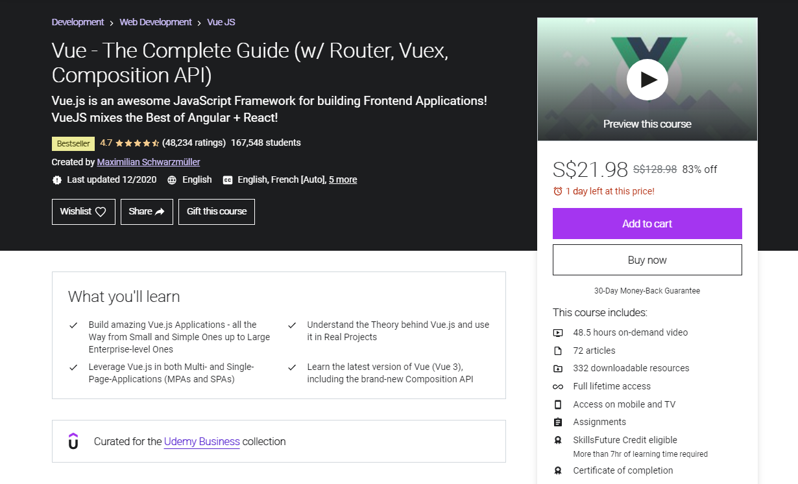
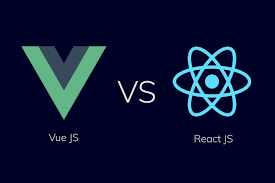
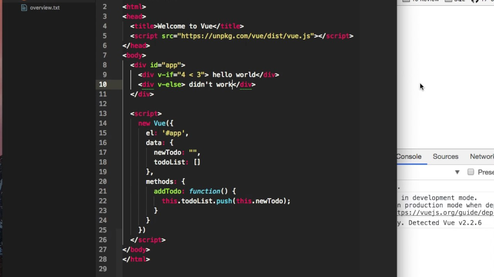
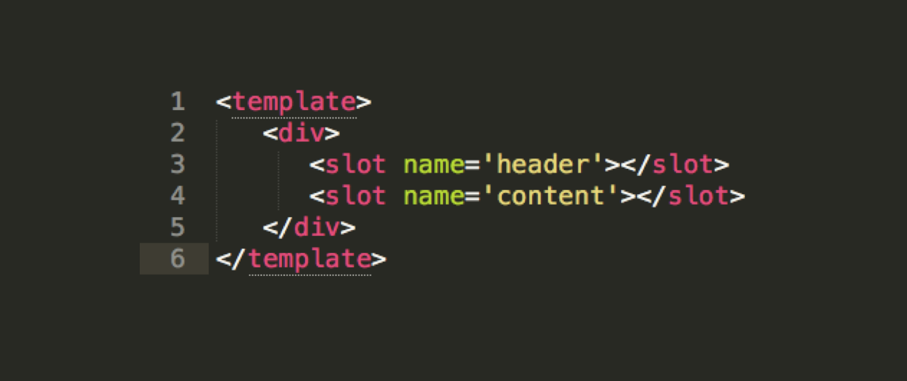
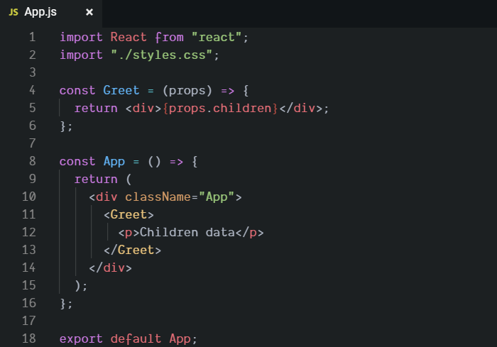
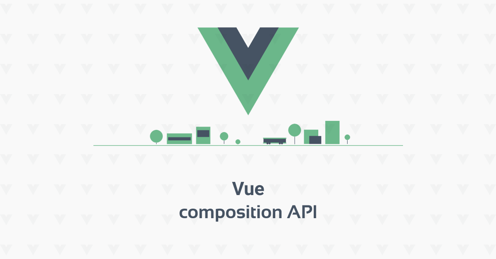

So far, React has been my go to Javascript framework for building web applications. I'd say that I'm relatively decent at creating apps with React, and have quite a few workable web applications that had been made with React as well. To a smaller extent, I have used other web frameworks such as Django, React Native and Flutter.

After hearing good reviews about Vue from several React developers, I got quite interested and decided to undertake the challenge of learning Vue as well. What's the worst that could happen? I won't like the framework and I'll waste a few days of my time - which I would be wasting watching YouTube videos anyways. Otherwise, I'll get another way to design web applications that may fit my preferences. Either way, I'll have a new framework that I can use under my belt.

## About the Course

Personally, I'm more of a visual learner, and greatly prefer learning through videos, especially if there's a coding example to go with the explanation. The above [course](https://www.udemy.com/course/vuejs-2-the-complete-guide/) by Maximilian Schwarzmüller was the one I went through. Courses on Udemy are constantly on sale, meaning that waiting a while for a sale would be advisable. (Not sponsored)

## Preface

My background is in React, and I'll kind of just be sharing the differences between React and Vue in my opinion. I didn't actually plan on speedrunning the course, but halfway through the course, I found that I was completing it at quite a fast pace, and tried to finish it as fast as possible, while absorbing as much as I can (by spending a lot of time on it and not getting distracted).

## Basics

The course started off with teaching us how to use the `v-<something>` attributes, logic and components. From the start, I could already see some differences from React in terms of handling logic.

Most of the logic (events, two-way-binding, methods) are similar, only the way the logic was handled is different. Right off the bat, Vue incorporates custom attributes into JSX (? not sure if Vue uses JSX) while React strictly handles logic outside of the JSX.

Some other differences I found were the watchers and computed options. In React, I used the `useEffect` hook to help me execute functions based on dependencies but in Vue, there are different functions for more specific conditions. The if and for functions are also able to be added as attributes, which is an interesting addition, but something I would have to get used to.

Something I didn't like about Vue is the need for quotes around attributes using Javascript. For example, if we want to put an if condition into our JSX, this would be the code: `v-if="goals.length === 0"`. It kind of makes it confusing in whether I'm referring to variables or writing a string.

## Node CLI, and more advanced features

In the second day, we moved on to using Node.js, the Vue CLI, and communication between components.

From here, things started to get more familiar. Working with NPM, having live updates and splitting logic into components makes it much easier to handle code in my opinion, possibly because I'm just more used to it.

### Communication between components

In my opinion, the logic for communication between components is basically the same as with React, with one exception. While a roundabout way (function passed to child, child executes function to mutate parent state) is required for children components to mutate parent elements' states in React, Vue makes it extremely simple to do so with events.

### Slots

Slots are among the few things that I find is more annoying to deal with in Vue compared to in React.

In React, to use component A as a wrapper, we can simply use `props.children` in component A, and wrap component B with component A.

I can see where Vue is going with their appropach though. They provide us with the option to use as many "children" elements as we want with named slots, which is not offered by React.

Despite my dislike for this syntax, from looking at the possibilites this offers, this might actually be better and more effective than React's syntax. It's not unreasonable to say that I have just been conditioned to have a preference for React's syntax and I'll might prefer this if I get used to it.

### Routing

Routing basically works the same way as in React. As base Vue and base React are both designed to work as a single page application, the way routes are being handled are similar to each other, despite needing different packages.

We can choose our order we want Vue to process routes, get route parameters, query parameters and many more that can also be done with React's router package.

## Vuex

Compared to React's Redux, I greatly prefer Vue's Vuex, despite just learning how to use it.

Although they basically perform the same functionality in terms of being a store, the entire feel of Vuex is much more intuitive and feels less bloatey compared to Redux.

After learning Redux, I only used it reluctantly once or twice in my own projects. However, I would probably use Vuex very often in personal Vue projects when I can.

First off, this might be a personal preference, but I dislike using reducers and actions. The logic behind reducers and actions are not hard to grasp - but it just feels like a roundabout approach to mutate state.

Also, another thing that makes Vuex so much more convenient than Redux is the way they handle the global state and methods. In Redux, if we want to get actions or reducers, we would have to import them in each component we wish to use them on. On the other hand, if we wanted to get the global state in Vuex, we would simply have to access the `$store` global property without importing anything else.

## Composition API

The Composition API was something that Vue introduced in Vue 3, which brought a fresh new way to write code in Vue. Instead of exporting options, we export a setup function where we put our state, methods and so on.

I guess a similarity we can find in React for the Composition API compared to the Options API would be the shift away from class-based components to a project being comprised of only functional components, with React Hooks taking over many functionalities.

I don't really have a preference between the Composition and Options API, but if I had to choose, I would probably go with the Composition API by virtue of its recency.

Also, the fact that we can create custom hooks draws parallels with React's own syntax, which makes it easier for me to adopt and familiarize with.

## Other stuff

The good thing about web frameworks that use NPM is that most NPM packages don't discriminate. Whether we're using Vue or React, a lot of NPM packages (such as JWT for authentication) are able to be used in both cases. This lowers the barrier to entry for developers from other frameworks such as React or Angular to learn a new language such as Vue, and makes it more attractive for them to start doing so, since they won't be starting from scratch. (Not that they are anyways, most of the logic carries over)

## Conclusion

Learning Vue was a good decision in my opinion. It wasn't hard to learn coming from a React background and I can see why many React developers enjoyed it. I thoroughly enjoyed it myself and can see myself using Vue for personal projects in the future. Having enjoyed Next.js (a React framework), I think I'll be more inclined to using Nuxtjs to develop projects, since it's a Vue framework inspired by Next.js, and would probably have the same if not similar functionalities as Next.js.
